# Jatra System Architecture - Visual Diagrams

## How to View These Diagrams

### Option 1: GitHub (Recommended)

1. Commit and push this file to GitHub
2. GitHub automatically renders Mermaid diagrams
3. View at: https://github.com/BayajidAlam/jatra/blob/main/docs/ARCHITECTURE_VISUAL.md

### Option 2: Mermaid Live Editor

1. Go to https://mermaid.live/
2. Copy any diagram code below
3. Paste into the editor
4. Export as PNG at 1920x1080

### Option 3: VS Code Extension

1. Install: "Markdown Preview Mermaid Support" extension
2. Open this file in VS Code
3. Press `Ctrl+Shift+V` (or `Cmd+Shift+V` on Mac)
4. Diagrams will render in preview pane

---

## 1. System Overview Architecture

```mermaid
flowchart TB
    subgraph Clients["👥 CLIENT APPLICATIONS"]
        Web["🌐 Web App<br/>(Next.js)"]
        Mobile["📱 Mobile App<br/>(React Native)"]
        Desktop["💻 Desktop App<br/>(Electron)"]
    end

    LB["⚖️ Load Balancer<br/>(NGINX Ingress)"]

    Gateway["🚪 API Gateway<br/>(Go + Gin)<br/>Port: 8080<br/>Auto-scale: 3-10 pods"]

    subgraph Services["🔧 MICROSERVICES"]
        Auth["🔐 Auth<br/>:3000"]
        User["👤 User<br/>:3001"]
        Schedule["📅 Schedule<br/>:3002"]
        Search["🔍 Search<br/>:3003"]
        Seat["🎫 Seat Reservation<br/>:3004<br/>⚠️ CRITICAL<br/>Auto-scale: 5-20 pods"]
        Booking["📝 Booking<br/>:3005"]
        Payment["💳 Payment<br/>:3006"]
        Ticket["🎟️ Ticket<br/>:3007"]
        Notif["📧 Notification<br/>:3008"]
        Admin["⚙️ Admin<br/>:3009"]
        Report["📊 Reporting<br/>:3010"]
    end

    subgraph Data["💾 DATA LAYER"]
        Postgres[("🐘 PostgreSQL 15<br/>11 Databases")]
        Redis[("🔴 Redis Cluster<br/>Atomic Locks")]
        RabbitMQ[("🐰 RabbitMQ<br/>Message Queue")]
    end

    subgraph External["🌐 EXTERNAL SERVICES"]
        SSL["💰 SSLCommerz"]
        SMS["📱 SMS Gateway"]
        Email["📧 Email Service"]
    end

    subgraph Monitor["📊 MONITORING"]
        Prom["📈 Prometheus"]
        Graf["📉 Grafana"]
        Jaeger["🔍 Jaeger"]
        Loki["📝 Loki"]
    end

    Web --> LB
    Mobile --> LB
    Desktop --> LB
    LB --> Gateway

    Gateway --> Auth
    Gateway --> User
    Gateway --> Schedule
    Gateway --> Search
    Gateway --> Seat
    Gateway --> Booking
    Gateway --> Payment
    Gateway --> Ticket
    Gateway --> Notif
    Gateway --> Admin
    Gateway --> Report

    Auth --> Postgres
    User --> Postgres
    Schedule --> Postgres
    Search --> Postgres
    Seat --> Postgres
    Booking --> Postgres
    Payment --> Postgres
    Ticket --> Postgres
    Notif --> Postgres

    Seat --> Redis
    Auth --> Redis
    Search --> Redis

    Payment -.->|events| RabbitMQ
    Booking -.->|events| RabbitMQ
    RabbitMQ -.-> Notif
    RabbitMQ -.-> Ticket

    Payment --> SSL
    Notif --> SMS
    Notif --> Email

    Services -.->|metrics| Prom
    Services -.->|traces| Jaeger
    Services -.->|logs| Loki
    Prom --> Graf

    style Seat fill:#ff6b6b,stroke:#cc5555,stroke-width:4px,color:#fff
    style Redis fill:#f39c12,stroke:#d68910,stroke-width:3px,color:#fff
    style Gateway fill:#e85d75,stroke:#b03a4d,stroke-width:3px,color:#fff
```



---

## 2. Critical Booking Flow (Sequence Diagram)


---

## 3. DevOps CI/CD Pipeline

```mermaid
flowchart LR
    subgraph Dev["👨‍💻 DEVELOPMENT"]
        Code["Write Code"]
        Commit["Git Commit"]
        Push["Git Push"]
    end

    subgraph CI["🔨 CONTINUOUS INTEGRATION"]
        Trigger["Webhook Trigger"]
        Detect["Detect Changed<br/>Services"]
        Test["Run Tests<br/>• Lint<br/>• Unit<br/>• Integration"]
        Build["Build Docker<br/>Images"]
        Push_Reg["Push to<br/>Registry"]
    end

    subgraph CD["🚀 CONTINUOUS DEPLOYMENT"]
        Dev_Deploy["Deploy to Dev"]
        Stage_Deploy["Deploy to<br/>Staging"]
        Prod_Deploy["Deploy to<br/>Production<br/>(Rolling Update)"]
    end

    subgraph Monitor["📊 VALIDATION"]
        Health["Health Checks"]
        Metrics["Monitor Metrics"]
        Alert["Alert on<br/>Failure"]
    end

    Code --> Commit
    Commit --> Push
    Push --> Trigger
    Trigger --> Detect
    Detect --> Test
    Test --> Build
    Build --> Push_Reg
    Push_Reg --> Dev_Deploy
    Dev_Deploy --> Stage_Deploy
    Stage_Deploy --> Prod_Deploy
    Prod_Deploy --> Health
    Health --> Metrics
    Metrics --> Alert

    style Test fill:#4caf50,stroke:#388e3c,stroke-width:2px,color:#fff
    style Prod_Deploy fill:#9c27b0,stroke:#7b1fa2,stroke-width:2px,color:#fff
    style Alert fill:#f44336,stroke:#d32f2f,stroke-width:2px,color:#fff
```



---

## 4. Monitoring & Observability Stack


---

## 5. Data Flow Architecture

```mermaid
flowchart LR
    subgraph Client["CLIENT"]
        User["👤 User"]
    end

    subgraph Entry["ENTRY POINT"]
        LB["Load Balancer"]
        GW["API Gateway"]
    end

    subgraph Sync["SYNC SERVICES"]
        Auth["Auth"]
        Seat["Seat<br/>Reservation"]
        Booking["Booking"]
        Payment["Payment"]
    end

    subgraph Async["ASYNC SERVICES"]
        Queue["RabbitMQ"]
        Ticket["Ticket"]
        Notif["Notification"]
    end

    subgraph Data["DATA STORES"]
        PG[("PostgreSQL")]
        RD[("Redis")]
    end

    User -->|HTTPS| LB
    LB --> GW
    GW -->|REST| Auth
    GW -->|REST| Seat
    GW -->|REST| Booking
    GW -->|REST| Payment

    Auth --> PG
    Auth --> RD
    Seat --> PG
    Seat -->|Atomic Lock| RD
    Booking --> PG
    Payment --> PG

    Payment -.->|Event| Queue
    Booking -.->|Event| Queue
    Queue -.-> Ticket
    Queue -.-> Notif

    Ticket --> PG
    Notif --> PG

    style User fill:#4a90e2,stroke:#2e5c8a,stroke-width:2px,color:#fff
    style Seat fill:#ff6b6b,stroke:#cc5555,stroke-width:3px,color:#fff
    style RD fill:#f39c12,stroke:#d68910,stroke-width:3px,color:#fff
    style Queue fill:#3498db,stroke:#2874a6,stroke-width:2px,color:#fff
```



---

## 6. Redis Atomic Seat Locking


---

## 7. Kubernetes Deployment Architecture

```mermaid
flowchart TB
    subgraph K8S["☸️ KUBERNETES CLUSTER"]
        subgraph NS["Namespace: jatra"]
            subgraph Ingress["Ingress Layer"]
                ING["NGINX Ingress<br/>TLS Termination"]
            end

            subgraph Apps["Application Pods"]
                GW1["API Gateway<br/>Pod 1"]
                GW2["API Gateway<br/>Pod 2"]
                GW3["API Gateway<br/>Pod 3"]

                SR1["Seat Reservation<br/>Pod 1"]
                SR2["Seat Reservation<br/>Pod 2"]
                SR3["Seat Reservation<br/>Pod 3-20"]

                Other["Other Services<br/>Pods"]
            end

            subgraph Stateful["StatefulSets"]
                PG["PostgreSQL<br/>Master"]
                PG_R["PostgreSQL<br/>Replicas"]
                RD1["Redis Node 1"]
                RD2["Redis Node 2"]
                RD3["Redis Nodes 3-7"]
            end

            subgraph Auto["Auto-Scaling"]
                HPA["Horizontal Pod<br/>Autoscaler<br/>CPU: 70%<br/>Memory: 80%"]
                CA["Cluster<br/>Autoscaler"]
            end
        end

        subgraph Monitor["Monitoring"]
            PROM["Prometheus"]
            GRAF["Grafana"]
        end
    end

    ING --> GW1
    ING --> GW2
    ING --> GW3

    GW1 --> SR1
    GW2 --> SR2
    GW3 --> SR3

    SR1 --> RD1
    SR2 --> RD2
    SR3 --> RD3

    SR1 --> PG
    SR2 --> PG
    SR3 --> PG

    PG --> PG_R

    HPA -.->|Scale| GW1
    HPA -.->|Scale| SR1
    CA -.->|Add Nodes| K8S

    Apps -.-> PROM
    PROM --> GRAF

    style ING fill:#e85d75,stroke:#b03a4d,stroke-width:3px,color:#fff
    style SR1 fill:#ff6b6b,stroke:#cc5555,stroke-width:3px,color:#fff
    style SR2 fill:#ff6b6b,stroke:#cc5555,stroke-width:3px,color:#fff
    style SR3 fill:#ff6b6b,stroke:#cc5555,stroke-width:3px,color:#fff
    style HPA fill:#4caf50,stroke:#388e3c,stroke-width:2px,color:#fff
```



---

## Key Metrics & Performance

### System Capacity

- **Peak Traffic**: 30M hits in 30 minutes
- **Concurrent Seat Attempts**: 1,187+ per seat
- **Target Response Time**: < 3 seconds (booking flow)
- **Redis Lock Time**: 5-10ms (atomic operation)
- **Database Connections**: Pool size 100 per service

### Auto-Scaling Configuration

- **API Gateway**: 3-10 pods (CPU > 70%)
- **Seat Reservation**: 5-20 pods (CPU > 70%, critical service)
- **Other Services**: 3-10 pods (CPU > 70%)
- **Cluster Autoscaler**: Add nodes when pods pending > 30s

### Monitoring Intervals

- **Prometheus Scrape**: Every 15 seconds
- **Health Checks**: Every 10 seconds
- **Log Aggregation**: Real-time streaming
- **Alert Evaluation**: Every 30 seconds

---

## Technology Stack Summary

| Layer             | Technology                      | Purpose                        |
| ----------------- | ------------------------------- | ------------------------------ |
| **Frontend**      | Next.js, React Native, Electron | Multi-platform clients         |
| **API Gateway**   | Go + Gin                        | High-performance routing       |
| **Services**      | NestJS (TypeScript)             | 11 microservices               |
| **Databases**     | PostgreSQL 15                   | 11 databases (one per service) |
| **Cache**         | Redis 7 Cluster                 | Atomic locks, sessions, OTP    |
| **Queue**         | RabbitMQ 3.12                   | Async event messaging          |
| **Orchestration** | Kubernetes 1.28+                | Container management           |
| **IaC**           | Pulumi                          | Infrastructure as Code         |
| **CI/CD**         | Jenkins                         | Automated pipelines            |
| **Monitoring**    | Prometheus, Grafana             | Metrics & visualization        |
| **Tracing**       | Jaeger + OpenTelemetry          | Distributed tracing            |
| **Logging**       | Loki                            | Centralized logs               |

---

## How to Export for Presentations

### For 1920x1080 Slides:

1. **Using Mermaid Live Editor**:

   ```
   - Go to https://mermaid.live/
   - Copy diagram code
   - Click "Actions" → "Export PNG"
   - Set width: 1920, height: 1080
   - Download
   ```

2. **Using CLI**:

   ```bash
   npm install -g @mermaid-js/mermaid-cli
   mmdc -i diagram.mmd -o output.png -w 1920 -H 1080
   ```

3. **Using VS Code**:
   ```
   - Install "Markdown Preview Mermaid Support"
   - Open preview (Ctrl+Shift+V)
   - Take screenshot in fullscreen mode
   ```

---

**Created**: November 17, 2025  
**Project**: Jatra Railway Ticketing System  
**Purpose**: BSc Thesis Defense Presentations  
**Resolution**: Optimized for 1920x1080 displays
