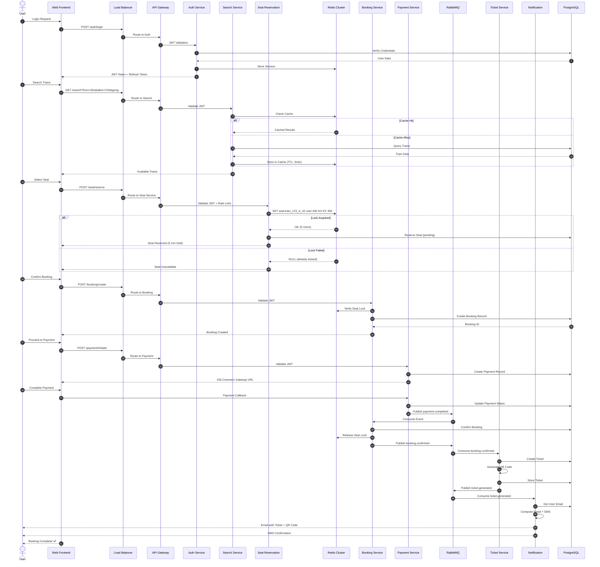

# Jatra Railway Ticketing System - Complete Architecture Diagram

## Full System Architecture (1920x1080)

This diagram shows the complete system including:

- Client applications
- API Gateway
- 11 Microservices
- Data layer (PostgreSQL, Redis, RabbitMQ)
- DevOps CI/CD Pipeline
- Monitoring & Observability Stack
- External integrations

---

## Comprehensive Architecture Diagram

```mermaid
graph TB
    %% Styling
    classDef client fill:#4A90E2,stroke:#2E5C8A,stroke-width:2px,color:#fff
    classDef gateway fill:#E85D75,stroke:#B03A4D,stroke-width:2px,color:#fff
    classDef service fill:#50C878,stroke:#2D8B57,stroke-width:2px,color:#fff
    classDef critical fill:#FF6B6B,stroke:#CC5555,stroke-width:3px,color:#fff
    classDef database fill:#9B59B6,stroke:#7D3C98,stroke-width:2px,color:#fff
    classDef cache fill:#F39C12,stroke:#D68910,stroke-width:2px,color:#fff
    classDef queue fill:#3498DB,stroke:#2874A6,stroke-width:2px,color:#fff
    classDef monitor fill:#1ABC9C,stroke:#148F77,stroke-width:2px,color:#fff
    classDef cicd fill:#E74C3C,stroke:#C0392B,stroke-width:2px,color:#fff
    classDef external fill:#95A5A6,stroke:#7F8C8D,stroke-width:2px,color:#fff

    %% Client Layer
    subgraph CLIENT["🖥️ CLIENT LAYER"]
        WEB[Web App<br/>Next.js]:::client
        MOBILE[Mobile App<br/>React Native]:::client
        DESKTOP[Desktop App<br/>Electron]:::client
    end

    %% Load Balancer
    LB[⚖️ Load Balancer<br/>NGINX Ingress<br/>Rate Limiting: 100 req/min]:::gateway

    %% API Gateway
    APIGW[🚪 API Gateway<br/>Go + Gin<br/>Port: 8080<br/>HPA: 3-10 pods<br/>JWT Validation]:::gateway

    %% Microservices Layer
    subgraph SERVICES["🔧 MICROSERVICES (NestJS)"]
        AUTH[🔐 Auth Service<br/>Port: 3000<br/>JWT, OTP, Login]:::service
        USER[👤 User Service<br/>Port: 3001<br/>Profiles, Passengers]:::service
        SCHEDULE[📅 Schedule Service<br/>Port: 3002<br/>Trains, Routes]:::service
        SEARCH[🔍 Search Service<br/>Port: 3003<br/>Redis Cache]:::service
        SEAT[🎫 Seat Reservation<br/>Port: 3004<br/>Redis Atomic Locks<br/>HPA: 5-20 pods<br/>⚠️ CRITICAL]:::critical
        BOOKING[📝 Booking Service<br/>Port: 3005<br/>Multi-Passenger]:::service
        PAYMENT[💳 Payment Service<br/>Port: 3006<br/>SSLCommerz]:::service
        TICKET[🎟️ Ticket Service<br/>Port: 3007<br/>QR Codes, PDF]:::service
        NOTIF[📧 Notification<br/>Port: 3008<br/>Email, SMS]:::service
        ADMIN[⚙️ Admin Service<br/>Port: 3009<br/>Management]:::service
        REPORT[📊 Reporting<br/>Port: 3010<br/>Analytics]:::service
    end

    %% Data Layer
    subgraph DATA["💾 DATA LAYER"]
        subgraph POSTGRES["PostgreSQL 15 (StatefulSet)"]
            DB1[(auth_db)]:::database
            DB2[(user_db)]:::database
            DB3[(schedule_db)]:::database
            DB4[(seat_reservation_db)]:::database
            DB5[(booking_db)]:::database
            DB6[(payment_db)]:::database
            DB7[(ticket_db)]:::database
            DB8[(notification_db)]:::database
            DB9[(admin_db)]:::database
            DB10[(reporting_db)]:::database
            DB11[(search_db)]:::database
        end

        REDIS[🔴 Redis Cluster<br/>7 nodes<br/>Seat Locks: SET NX EX<br/>OTP Cache<br/>Session Store]:::cache

        RABBITMQ[🐰 RabbitMQ<br/>Async Events<br/>payment.completed<br/>booking.confirmed<br/>ticket.generated]:::queue
    end

    %% External Services
    subgraph EXTERNAL["🌐 EXTERNAL INTEGRATIONS"]
        SSLCOMMERZ[💰 SSLCommerz<br/>Payment Gateway]:::external
        SMS_GATEWAY[📱 SMS Gateway<br/>OTP Delivery]:::external
        EMAIL[📧 Email Service<br/>SMTP/SendGrid]:::external
    end

    %% Monitoring & Observability
    subgraph MONITORING["📊 MONITORING & OBSERVABILITY"]
        PROMETHEUS[📈 Prometheus<br/>Metrics Collection<br/>Scrape: 15s]:::monitor
        GRAFANA[📉 Grafana<br/>Dashboards<br/>Visualization]:::monitor
        JAEGER[🔍 Jaeger<br/>Distributed Tracing<br/>OpenTelemetry]:::monitor
        LOKI[📝 Loki<br/>Log Aggregation<br/>Centralized Logs]:::monitor
    end

    %% CI/CD Pipeline
    subgraph CICD["🚀 CI/CD PIPELINE"]
        GITHUB[📦 GitHub<br/>Source Control]:::cicd
        JENKINS[🔨 Jenkins<br/>CI/CD Automation]:::cicd
        DOCKER[🐳 Docker Registry<br/>Image Storage]:::cicd
        K8S[☸️ Kubernetes<br/>1.28+<br/>Auto-scaling<br/>Self-healing]:::cicd
    end

    %% Client to Load Balancer
    WEB --> LB
    MOBILE --> LB
    DESKTOP --> LB

    %% Load Balancer to API Gateway
    LB --> APIGW

    %% API Gateway to Services (Critical Path)
    APIGW --> AUTH
    APIGW --> USER
    APIGW --> SCHEDULE
    APIGW --> SEARCH
    APIGW --> SEAT
    APIGW --> BOOKING
    APIGW --> PAYMENT
    APIGW --> TICKET
    APIGW --> NOTIF
    APIGW --> ADMIN
    APIGW --> REPORT

    %% Services to Databases
    AUTH --> DB1
    USER --> DB2
    SCHEDULE --> DB3
    SEAT --> DB4
    BOOKING --> DB5
    PAYMENT --> DB6
    TICKET --> DB7
    NOTIF --> DB8
    ADMIN --> DB9
    REPORT --> DB10
    SEARCH --> DB11

    %% Critical Services to Redis (Atomic Operations)
    SEAT --> REDIS
    AUTH --> REDIS
    SEARCH --> REDIS
    USER --> REDIS

    %% Services to RabbitMQ (Async Events)
    PAYMENT -.->|payment.completed| RABBITMQ
    BOOKING -.->|booking.confirmed| RABBITMQ
    TICKET -.->|ticket.generated| RABBITMQ
    RABBITMQ -.->|consume| NOTIF
    RABBITMQ -.->|consume| TICKET
    RABBITMQ -.->|consume| REPORT

    %% External Service Integrations
    PAYMENT --> SSLCOMMERZ
    NOTIF --> SMS_GATEWAY
    NOTIF --> EMAIL

    %% Monitoring Connections
    APIGW -.->|metrics| PROMETHEUS
    AUTH -.->|metrics| PROMETHEUS
    USER -.->|metrics| PROMETHEUS
    SCHEDULE -.->|metrics| PROMETHEUS
    SEARCH -.->|metrics| PROMETHEUS
    SEAT -.->|metrics| PROMETHEUS
    BOOKING -.->|metrics| PROMETHEUS
    PAYMENT -.->|metrics| PROMETHEUS
    TICKET -.->|metrics| PROMETHEUS
    NOTIF -.->|metrics| PROMETHEUS
    ADMIN -.->|metrics| PROMETHEUS
    REPORT -.->|metrics| PROMETHEUS

    %% Monitoring Stack Connections
    PROMETHEUS --> GRAFANA
    APIGW -.->|traces| JAEGER
    SEAT -.->|traces| JAEGER
    BOOKING -.->|traces| JAEGER
    PAYMENT -.->|traces| JAEGER

    APIGW -.->|logs| LOKI
    AUTH -.->|logs| LOKI
    SEAT -.->|logs| LOKI
    BOOKING -.->|logs| LOKI
    PAYMENT -.->|logs| LOKI
    NOTIF -.->|logs| LOKI

    %% CI/CD Flow
    GITHUB -->|push| JENKINS
    JENKINS -->|build| DOCKER
    DOCKER -->|deploy| K8S
    K8S -->|orchestrate| APIGW
    K8S -->|orchestrate| AUTH
    K8S -->|orchestrate| SEAT
    K8S -->|orchestrate| BOOKING
    K8S -->|orchestrate| PAYMENT
```



---

## Critical Booking Flow (Detailed)



---

## DevOps CI/CD Pipeline (Detailed)

```mermaid
graph LR
    %% Styling
    classDef gitStyle fill:#F05032,stroke:#C63D2F,stroke-width:2px,color:#fff
    classDef ciStyle fill:#D24939,stroke:#A53629,stroke-width:2px,color:#fff
    classDef testStyle fill:#4CAF50,stroke:#388E3C,stroke-width:2px,color:#fff
    classDef buildStyle fill:#2196F3,stroke:#1976D2,stroke-width:2px,color:#fff
    classDef deployStyle fill:#9C27B0,stroke:#7B1FA2,stroke-width:2px,color:#fff
    classDef monitorStyle fill:#FF9800,stroke:#F57C00,stroke-width:2px,color:#fff

    %% Developer Workflow
    DEV[👨‍💻 Developer<br/>Local Development]:::gitStyle

    %% Git Flow
    subgraph GIT["📦 GIT WORKFLOW"]
        BRANCH[Create Feature Branch<br/>git checkout -b feature/xyz]:::gitStyle
        COMMIT[Commit Changes<br/>git commit -m 'feat: xyz']:::gitStyle
        PUSH[Push to Remote<br/>git push origin feature/xyz]:::gitStyle
        PR[Create Pull Request<br/>GitHub]:::gitStyle
    end

    %% CI Pipeline
    subgraph CI["🔨 CONTINUOUS INTEGRATION (Jenkins)"]
        TRIGGER[🔔 Webhook Trigger<br/>on PR/Push]:::ciStyle
        DETECT[🔍 Smart Detection<br/>Detect Changed Services]:::ciStyle
        CHECKOUT[📥 Checkout Code<br/>Clone Repository]:::ciStyle

        subgraph TESTS["🧪 TESTING PHASE"]
            LINT[ESLint + Prettier<br/>Code Quality]:::testStyle
            UNIT[Unit Tests<br/>Jest/Vitest]:::testStyle
            INT[Integration Tests<br/>Supertest]:::testStyle
            SECURITY[Security Scan<br/>npm audit, Snyk]:::testStyle
        end

        BUILD[🔨 Build Services<br/>TypeScript Compile<br/>nx build]:::buildStyle
        DOCKER_BUILD[🐳 Build Docker Images<br/>Multi-stage Dockerfile]:::buildStyle
        PUSH_REGISTRY[📤 Push to Registry<br/>Docker Hub/ECR]:::buildStyle
    end

    %% CD Pipeline (only on main branch)
    subgraph CD["🚀 CONTINUOUS DEPLOYMENT"]
        APPROVE[✅ Manual Approval<br/>Production Gate]:::deployStyle
        HELM[⚓ Helm Chart Update<br/>Update Image Tags]:::deployStyle
        DEPLOY_DEV[🔷 Deploy to Dev<br/>Kubernetes Namespace: dev]:::deployStyle
        SMOKE_TEST[💨 Smoke Tests<br/>Health Checks]:::deployStyle
        DEPLOY_STAGING[🔶 Deploy to Staging<br/>Kubernetes Namespace: staging]:::deployStyle
        E2E[🎭 E2E Tests<br/>Playwright/Cypress]:::testStyle
        DEPLOY_PROD[🟢 Deploy to Production<br/>Rolling Update<br/>Zero Downtime]:::deployStyle
        ROLLBACK[⏮️ Auto Rollback<br/>on Failure]:::deployStyle
    end

    %% Monitoring
    subgraph MONITOR["📊 MONITORING & VALIDATION"]
        METRICS[📈 Metrics Check<br/>Prometheus Alerts]:::monitorStyle
        LOGS[📝 Log Analysis<br/>Loki/ELK]:::monitorStyle
        TRACES[🔍 Trace Validation<br/>Jaeger]:::monitorStyle
        ALERT[🚨 Alert on Failure<br/>Slack/Email]:::monitorStyle
    end

    %% Flow
    DEV --> BRANCH
    BRANCH --> COMMIT
    COMMIT --> PUSH
    PUSH --> PR

    PR --> TRIGGER
    TRIGGER --> DETECT
    DETECT --> CHECKOUT
    CHECKOUT --> LINT
    LINT --> UNIT
    UNIT --> INT
    INT --> SECURITY
    SECURITY --> BUILD
    BUILD --> DOCKER_BUILD
    DOCKER_BUILD --> PUSH_REGISTRY

    PUSH_REGISTRY --> APPROVE
    APPROVE --> HELM
    HELM --> DEPLOY_DEV
    DEPLOY_DEV --> SMOKE_TEST
    SMOKE_TEST --> DEPLOY_STAGING
    DEPLOY_STAGING --> E2E
    E2E --> DEPLOY_PROD

    DEPLOY_PROD --> METRICS
    METRICS --> LOGS
    LOGS --> TRACES
    TRACES -.->|Success| ALERT
    E2E -.->|Failure| ROLLBACK
    SMOKE_TEST -.->|Failure| ROLLBACK
    ROLLBACK --> ALERT
```



---

## Monitoring & Observability Stack

```mermaid
graph TB
    %% Styling
    classDef appStyle fill:#4CAF50,stroke:#388E3C,stroke-width:2px,color:#fff
    classDef metricStyle fill:#2196F3,stroke:#1976D2,stroke-width:2px,color:#fff
    classDef logStyle fill:#FF9800,stroke:#F57C00,stroke-width:2px,color:#fff
    classDef traceStyle fill:#9C27B0,stroke:#7B1FA2,stroke-width:2px,color:#fff
    classDef alertStyle fill:#F44336,stroke:#D32F2F,stroke-width:2px,color:#fff

    %% Application Layer
    subgraph APPS["🔧 APPLICATION SERVICES"]
        APP1[API Gateway]:::appStyle
        APP2[Auth Service]:::appStyle
        APP3[Seat Reservation]:::appStyle
        APP4[Booking Service]:::appStyle
        APP5[Payment Service]:::appStyle
        APP6[Other Services...]:::appStyle
    end

    %% Metrics Collection
    subgraph METRICS["📈 METRICS (Time-Series Data)"]
        PROM[Prometheus<br/>Metrics Server<br/>Scrape: 15s]:::metricStyle
        PROM_RULES[Recording Rules<br/>Aggregation]:::metricStyle
        PROM_ALERTS[Alert Rules<br/>Thresholds]:::metricStyle

        subgraph METRIC_TYPES["Metric Types"]
            COUNTER[Counters<br/>requests_total]:::metricStyle
            GAUGE[Gauges<br/>active_connections]:::metricStyle
            HISTOGRAM[Histograms<br/>response_time]:::metricStyle
        end
    end

    %% Logging
    subgraph LOGS["📝 LOGS (Structured Logging)"]
        LOKI[Loki<br/>Log Aggregation]:::logStyle
        PROMTAIL[Promtail<br/>Log Collector]:::logStyle

        subgraph LOG_TYPES["Log Levels"]
            ERROR[ERROR: Exceptions]:::logStyle
            WARN[WARN: Warnings]:::logStyle
            INFO[INFO: Events]:::logStyle
            DEBUG[DEBUG: Verbose]:::logStyle
        end
    end

    %% Distributed Tracing
    subgraph TRACES["🔍 DISTRIBUTED TRACING"]
        JAEGER[Jaeger<br/>Trace Storage & UI]:::traceStyle
        OTEL[OpenTelemetry<br/>Instrumentation]:::traceStyle

        subgraph TRACE_COMPONENTS["Trace Components"]
            SPAN[Spans<br/>Operation Units]:::traceStyle
            TRACE_ID[Trace IDs<br/>Request Journey]:::traceStyle
            CONTEXT[Context Propagation<br/>Cross-Service]:::traceStyle
        end
    end

    %% Visualization
    subgraph VIZ["📊 VISUALIZATION & DASHBOARDS"]
        GRAFANA[Grafana<br/>Unified Dashboard]:::metricStyle

        subgraph DASHBOARDS["Pre-built Dashboards"]
            DASH1[System Overview<br/>CPU, Memory, Network]:::metricStyle
            DASH2[Service Performance<br/>Latency, Throughput]:::metricStyle
            DASH3[Business Metrics<br/>Bookings, Revenue]:::metricStyle
            DASH4[Error Tracking<br/>4xx, 5xx errors]:::metricStyle
        end
    end

    %% Alerting
    subgraph ALERTS["🚨 ALERTING & INCIDENT RESPONSE"]
        ALERT_MGR[Alertmanager<br/>Alert Routing]:::alertStyle

        subgraph CHANNELS["Notification Channels"]
            SLACK[Slack<br/>Team Alerts]:::alertStyle
            EMAIL_ALERT[Email<br/>Critical Alerts]:::alertStyle
            PAGERDUTY[PagerDuty<br/>On-Call]:::alertStyle
        end

        subgraph ALERT_RULES["Alert Rules"]
            RULE1[High Error Rate<br/>> 5% errors]:::alertStyle
            RULE2[High Latency<br/>p95 > 500ms]:::alertStyle
            RULE3[Pod Crashes<br/>Restart loops]:::alertStyle
            RULE4[Resource Exhaustion<br/>CPU > 90%]:::alertStyle
        end
    end

    %% Connections
    APP1 -->|/metrics| PROM
    APP2 -->|/metrics| PROM
    APP3 -->|/metrics| PROM
    APP4 -->|/metrics| PROM
    APP5 -->|/metrics| PROM
    APP6 -->|/metrics| PROM

    PROM --> PROM_RULES
    PROM --> PROM_ALERTS
    PROM_RULES --> COUNTER
    PROM_RULES --> GAUGE
    PROM_RULES --> HISTOGRAM

    APP1 -->|stdout/stderr| PROMTAIL
    APP2 -->|stdout/stderr| PROMTAIL
    APP3 -->|stdout/stderr| PROMTAIL
    APP4 -->|stdout/stderr| PROMTAIL
    APP5 -->|stdout/stderr| PROMTAIL
    APP6 -->|stdout/stderr| PROMTAIL
    PROMTAIL --> LOKI
    LOKI --> ERROR
    LOKI --> WARN
    LOKI --> INFO
    LOKI --> DEBUG

    APP1 -->|traces| OTEL
    APP2 -->|traces| OTEL
    APP3 -->|traces| OTEL
    APP4 -->|traces| OTEL
    APP5 -->|traces| OTEL
    OTEL --> JAEGER
    JAEGER --> SPAN
    JAEGER --> TRACE_ID
    JAEGER --> CONTEXT

    PROM --> GRAFANA
    LOKI --> GRAFANA
    JAEGER --> GRAFANA
    GRAFANA --> DASH1
    GRAFANA --> DASH2
    GRAFANA --> DASH3
    GRAFANA --> DASH4

    PROM_ALERTS --> ALERT_MGR
    ALERT_MGR --> SLACK
    ALERT_MGR --> EMAIL_ALERT
    ALERT_MGR --> PAGERDUTY
    ALERT_MGR --> RULE1
    ALERT_MGR --> RULE2
    ALERT_MGR --> RULE3
    ALERT_MGR --> RULE4
```



---

## Key Metrics Monitored

### System Metrics

- **CPU Usage**: 70% threshold for HPA scaling
- **Memory Usage**: 80% threshold for alerts
- **Network I/O**: Bytes sent/received per service
- **Disk Usage**: PostgreSQL volume capacity

### Application Metrics

- **Request Rate**: Requests per second (RPS)
- **Error Rate**: 4xx/5xx errors percentage
- **Latency**: p50, p95, p99 response times
- **Throughput**: Successful requests per minute

### Business Metrics

- **Bookings per Hour**: Peak traffic analysis
- **Seat Lock Success Rate**: Redis atomic operations
- **Payment Success Rate**: SSLCommerz integration
- **OTP Delivery Time**: Notification service performance
- **Average Booking Time**: User experience metric

### Infrastructure Metrics

- **Pod Count**: Current vs desired replicas
- **Pod Restarts**: Crash loop detection
- **Service Health**: Liveness/readiness probes
- **HPA Scaling Events**: Auto-scaling activity

---

## Alert Rules

### Critical Alerts (PagerDuty)

1. **Service Down**: All pods unavailable for > 2 minutes
2. **High Error Rate**: > 10% 5xx errors for > 5 minutes
3. **Database Connection Loss**: PostgreSQL unreachable
4. **Redis Cluster Failure**: Cache service unavailable

### Warning Alerts (Slack)

1. **Elevated Error Rate**: > 5% errors for > 5 minutes
2. **High Latency**: p95 > 500ms for > 10 minutes
3. **Pod Memory Pressure**: > 90% memory usage
4. **Frequent Pod Restarts**: > 3 restarts in 10 minutes

### Info Alerts (Email)

1. **Successful Deployment**: New version deployed
2. **HPA Scaling Event**: Pod count changed
3. **Resource Quota Warning**: 80% of namespace quota used

---

## How to Use These Diagrams

### For GitHub README

Copy the Mermaid code blocks directly into your README.md. GitHub will render them automatically.

### For Presentations

1. **Online Rendering**: Use [Mermaid Live Editor](https://mermaid.live/) to export as PNG/SVG
2. **VS Code**: Install "Markdown Preview Mermaid Support" extension
3. **Export**: Take screenshot at 1920x1080 resolution for slides

### For Documentation

These diagrams can be embedded in:

- Proposal defense slides (export as images)
- Technical documentation
- Architecture decision records (ADRs)
- System design documentation

---

## Diagram Features

### Comprehensive Coverage

✅ **11 Microservices**: All services shown with ports and responsibilities  
✅ **Data Layer**: 11 PostgreSQL databases, Redis, RabbitMQ  
✅ **DevOps Pipeline**: Complete CI/CD flow from code to production  
✅ **Monitoring Stack**: Prometheus, Grafana, Jaeger, Loki  
✅ **External Integrations**: SSLCommerz, SMS Gateway, Email  
✅ **Critical Path**: Seat Reservation highlighted (1,187+ concurrent attempts)

### Visual Clarity

- **Color Coding**: Different colors for each layer (client, gateway, services, data, monitoring)
- **Flow Indicators**: Solid lines for sync, dotted for async
- **HPA Annotations**: Auto-scaling ranges shown (3-10 pods, 5-20 pods)
- **Critical Services**: Red highlighting for seat reservation

### Technical Accuracy

- Port numbers for all services (3000-3010, 8080)
- Database names (auth_db, booking_db, etc.)
- Redis operations (SET NX EX for atomic locks)
- RabbitMQ events (payment.completed, booking.confirmed, ticket.generated)
- CI/CD stages (lint, test, build, deploy, monitor)

---

## Rendering Instructions

To render these diagrams at 1920x1080:

### Method 1: Mermaid Live Editor

```bash
1. Go to https://mermaid.live/
2. Paste the Mermaid code
3. Click "Export" → "PNG"
4. Set resolution to 1920x1080
5. Download high-quality image
```

### Method 2: VS Code Extension

```bash
1. Install "Markdown Preview Mermaid Support"
2. Open this file in VS Code
3. Click "Open Preview" (Ctrl+Shift+V)
4. Right-click diagram → "Copy as PNG"
5. Paste into presentation at full screen
```

### Method 3: CLI Tool (mmdc)

````bash
# Install Mermaid CLI
npm install -g @mermaid-js/mermaid-cli

# Extract diagram to separate .mmd file
cat SYSTEM_ARCHITECTURE_DIAGRAM.md | sed -n '/```mermaid/,/```/p' > diagram.mmd

# Render at 1920x1080
mmdc -i diagram.mmd -o architecture.png -w 1920 -H 1080 -b transparent
````

---

## Notes

- **Resolution**: Designed for 1920x1080 (Full HD) displays
- **Format**: Mermaid syntax (GitHub-compatible)
- **Rendering**: Works in GitHub, GitLab, VS Code, Notion, Obsidian
- **Export**: Can be exported to PNG, SVG, or PDF for presentations
- **Maintenance**: Easy to update - just edit text, diagram regenerates

---

**Created**: November 17, 2025  
**Project**: Jatra Railway Ticketing System  
**Purpose**: BSc Thesis Defense & Documentation
