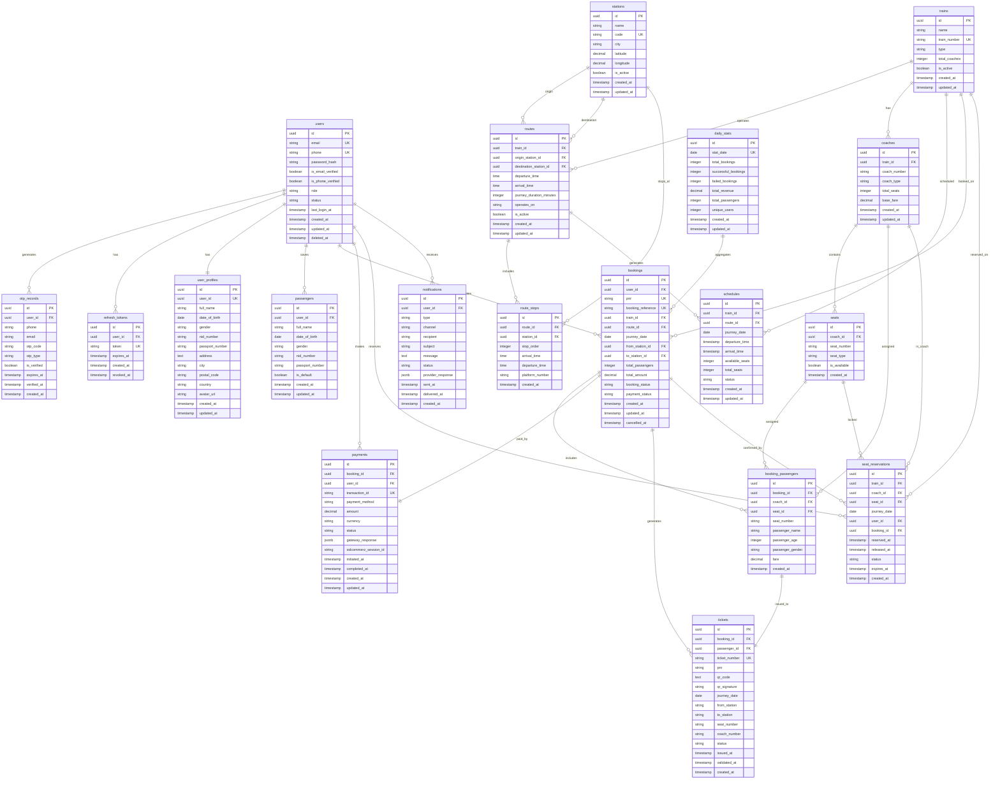

# Entity Relationship Diagram (ERD)

## Overview

This document describes the entity relationships across all microservices in the Jatra Railway Ticketing System.

## ERD Diagram (Mermaid)



## Cross-Service Data Flow

### Booking Flow

```
1. User Login (Auth Service)
   users → otp_records → refresh_tokens

2. Search Trains (Schedule Service)
   stations → routes → trains → schedules → coaches → seats

3. Reserve Seat (Seat Reservation Service)
   users → seat_reservations (+ Redis lock)

4. Create Booking (Booking Service)
   users → bookings → booking_passengers

5. Payment (Payment Service)
   users → payments → booking (update status)

6. Generate Ticket (Ticket Service)
   bookings → booking_passengers → tickets (with QR)

7. Send Notifications (Notification Service)
   users → notifications (SMS/Email)

8. Analytics (Reporting Service)
   bookings → daily_stats (aggregation)
```

## Key Relationships

### 1. User-Centric Relationships
- **users** (auth_db) → Referenced by all services via `user_id`
- No foreign keys across databases (microservices pattern)
- Services fetch user data via User Service API

### 2. Train & Schedule Relationships
- **trains** → **coaches** → **seats** (1:N:N)
- **routes** → **route_stops** (1:N with stop order)
- **trains** + **routes** → **schedules** (generated daily)

### 3. Booking Flow Relationships
- **bookings** → **booking_passengers** (1:N)
- **bookings** ↔ **payments** (1:1)
- **booking_passengers** ↔ **tickets** (1:1)

### 4. Seat Locking Flow
- **Redis Lock** (temporary) → **seat_reservations** (audit log) → **bookings** (confirmed)

## Data Consistency Patterns

### 1. Eventual Consistency
- Bookings trigger events → Notifications sent asynchronously
- Analytics updated via event listeners

### 2. Compensating Transactions (Saga Pattern)
- If payment fails → Release seat locks
- If booking cancelled → Refund payment → Cancel tickets

### 3. Idempotency
- All API operations use unique request IDs
- Duplicate payment attempts return same result

## Indexing Strategy

### High-Performance Queries

```sql
-- Most frequent queries:

-- 1. Search trains by route and date
CREATE INDEX idx_schedules_route_date ON schedules(route_id, journey_date);

-- 2. Find user bookings
CREATE INDEX idx_bookings_user_journey ON bookings(user_id, journey_date);

-- 3. Check seat availability
CREATE INDEX idx_reservations_train_date_status ON seat_reservations(train_id, journey_date, status);

-- 4. Payment lookup
CREATE INDEX idx_payments_booking_status ON payments(booking_id, status);

-- 5. Ticket validation
CREATE INDEX idx_tickets_pnr_journey ON tickets(pnr, journey_date, status);
```

## Database Size Estimates (1 Year, 1M Users)

| Database | Estimated Size | Notes |
|----------|---------------|-------|
| auth_db | ~500 MB | Users, OTPs, tokens |
| user_db | ~1 GB | Profiles, saved passengers |
| schedule_db | ~2 GB | Trains, routes, schedules (static + dynamic) |
| seat_reservation_db | ~5 GB | Audit logs (purge after 30 days) |
| booking_db | ~10 GB | Main transactional data |
| payment_db | ~3 GB | Payment records (keep forever) |
| ticket_db | ~8 GB | Tickets with QR codes |
| notification_db | ~4 GB | Notification logs (purge after 90 days) |
| reporting_db | ~500 MB | Aggregated stats |
| **Total** | **~34 GB** | Excludes indexes (~20% overhead) |

## Scaling Considerations

### Read Replicas
- **Schedule Service**: 2-3 read replicas (high read traffic)
- **Search Service**: Use schedule read replica
- **Reporting Service**: Dedicated replica with replication lag tolerance

### Partitioning (Future)
- `schedules` table: Partition by `journey_date` (monthly)
- `bookings` table: Partition by `created_at` (quarterly)
- `seat_reservations`: Partition by `journey_date` (monthly, purge old)

### Sharding (Future, if > 10M users)
- Shard `users` by `user_id` hash
- Shard `bookings` by `user_id` hash (co-locate with user data)

---

**Last Updated**: November 16, 2025
