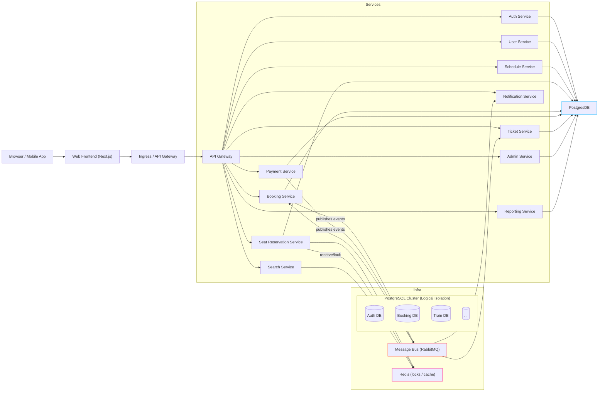

# Figure 3.1 — Microservices Architecture Diagram

Description

- High-level component diagram for the Jatra Railway system showing the web frontend, services, event bus, caches and databases.

Mermaid diagram

Notes

- Each microservice owns its data (database per service). Services communicate via synchronous HTTP (through ingress) and asynchronous events via RabbitMQ. Redis is used by the seat reservation service for fast locks and short-lived reservations.
