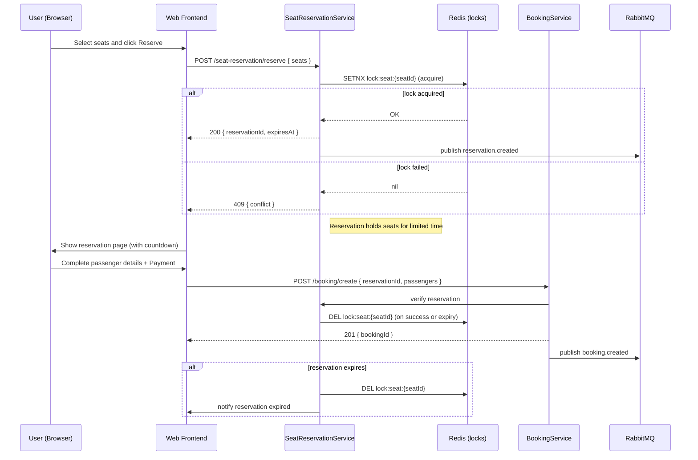

# Figure 3.2 — Redis Seat Locking Sequence Diagram

Description

- Sequence diagram describing how seat reservation uses Redis locks to provide short-term holds while a user completes booking.

Mermaid diagram

Notes

- `SETNX` (or Redlock variant) is used to acquire locks; reservation service ensures locks are cleared on booking creation or expiry.
