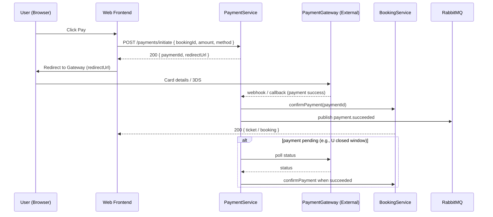

# Figure 3.3 — Payment Flow

Description

- Sequence diagram illustrating payment initiation, provider redirect/polling, and confirmation delivery to services.

Mermaid diagram

Notes

- Payment service accepts provider webhooks and confirms bookings through internal events.
