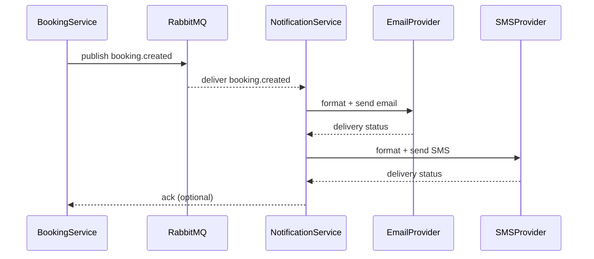

# Figure 3.4 — Notification Delivery

Description

- Flow showing how booking/ticket events lead to email/SMS notifications via Notification Service and message broker.

Mermaid diagram

Notes

- Notification service subscribes to booking and payment topics and sends templated messages.
