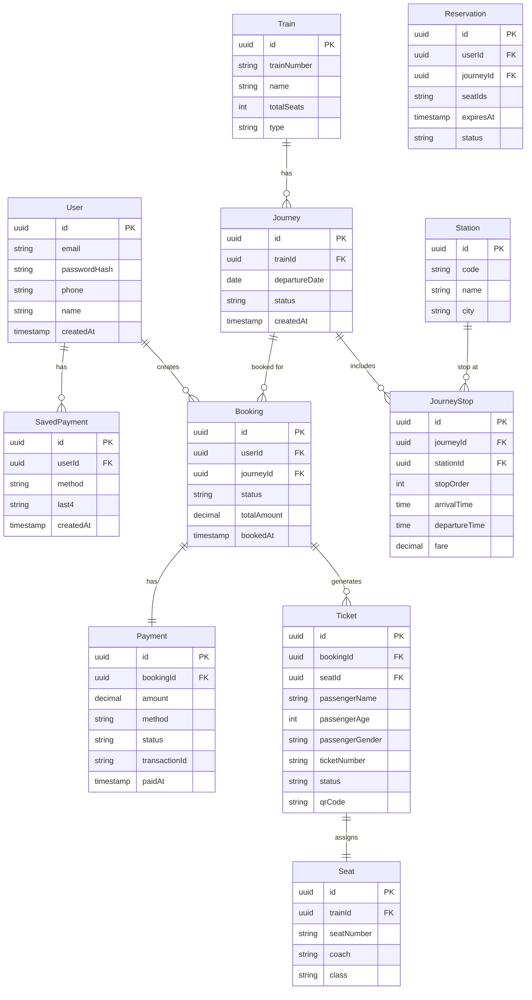

# Figure 4.1 — Database Schema (ERD)

Description

- Entity-Relationship Diagram showing the core database tables and their relationships in the Jatra Railway system.

Mermaid diagram

Notes

- Primary keys are UUIDs for distributed system compatibility.
- Journey represents a specific train departure on a specific date.
- Reservation holds seats temporarily using Redis locks (not shown in persistent DB).
