# Figure 4.2 — API Endpoints Overview

Description

- High-level view of REST API endpoints organized by service.

Mermaid diagram

```mermaid
graph TB
  subgraph "API Gateway :3000"
    GW[Proxy & Rate Limiting]
  end

  subgraph "Auth Service :3001"
    A1[POST /auth/register]
    A2[POST /auth/login]
    A3[POST /auth/refresh]
    A4[GET /auth/profile]
  end

  subgraph "Schedule Service :3002"
    S1[GET /stations]
    S2[GET /trains]
    S3[GET /journeys/search]
    S4[GET /journeys/:id]
  end

  subgraph "Seat Reservation Service :3003"
    R1[POST /seat-reservation/reserve]
    R2[GET /seat-reservation/:id]
    R3[POST /seat-reservation/release]
    R4[GET /seat-reservation/available/:journeyId]
  end

  subgraph "Booking Service :3004"
    B1[POST /booking/create]
    B2[GET /booking/:id]
    B3[GET /booking/user/:userId]
    B4[PATCH /booking/:id/cancel]
  end

  subgraph "Payment Service :3005"
    P1[POST /payments/initiate]
    P2[GET /payments/:id]
    P3[POST /payments/webhook]
    P4[GET /payments/methods]
  end

  subgraph "Ticket Service :3006"
    T1[GET /tickets/:id]
    T2[GET /tickets/booking/:bookingId]
    T3[GET /tickets/user/:userId]
    T4[PATCH /tickets/:id/validate]
  end

  subgraph "Notification Service :3007"
    N1[POST /notifications/send]
    N2[GET /notifications/user/:userId]
  end

  subgraph "User Service :3008"
    U1[GET /users/profile]
    U2[PATCH /users/profile]
    U3[GET /users/passengers]
    U4[POST /users/passengers]
  end

  subgraph "Search Service :3009"
    SE1[GET /search/journeys]
    SE2[GET /search/suggestions]
    SE3[POST /search/cache/clear]
  end

  subgraph "Admin Service :3010"
    AD1[POST /admin/trains]
    AD2[POST /admin/routes]
    AD3[GET /admin/bookings]
    AD4[GET /admin/users]
  end

  subgraph "Reporting Service :3011"
    RP1[GET /reports/sales]
    RP2[GET /reports/operations]
    RP3[GET /reports/financial]
  end

  Client[Web Frontend] --> GW
  GW --> A1
  GW --> A2
  GW --> S3
  GW --> SE1
  GW --> R1
  GW --> B1
  GW --> P1
  GW --> T1
  GW --> U1
  GW --> AD1
  GW --> RP1
```

Notes

- All endpoints require JWT authentication except /auth/register and /auth/login.
- Services communicate internally via RabbitMQ for async operations.
