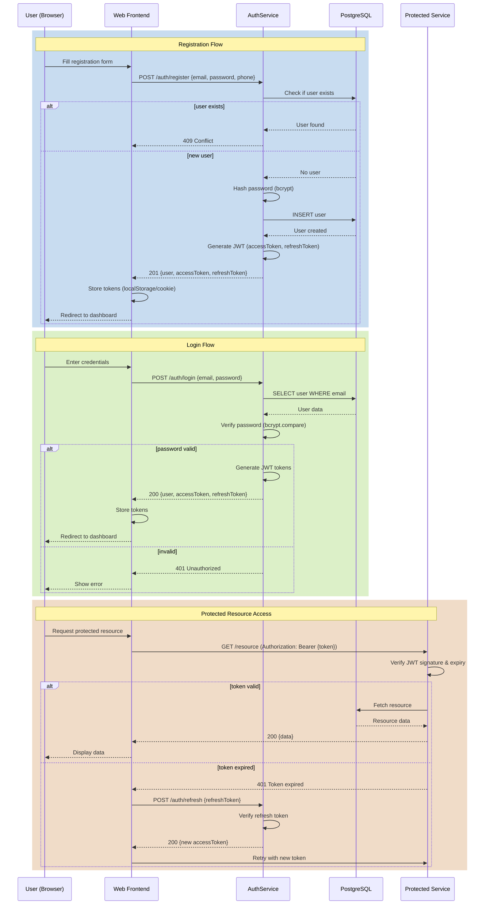

# Figure 4.3 — Authentication & Authorization Flow

Description

- JWT-based authentication flow showing registration, login, and protected resource access.

Mermaid diagram

Notes

- Access tokens expire in 15 minutes; refresh tokens in 7 days.
- Password hashing uses bcrypt with 10 rounds.
- JWT payload includes: userId, email, role, exp, iat.
