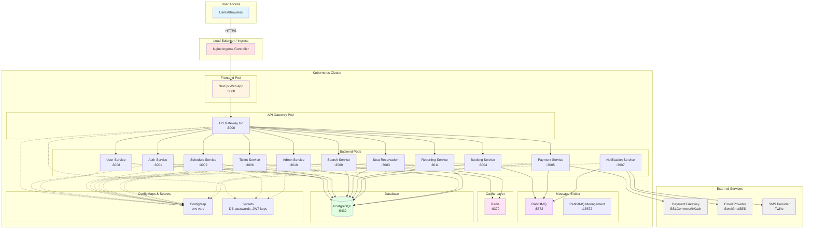

# Figure 4.4 — Deployment Architecture

Description

- Container-based deployment architecture showing how services are deployed on Kubernetes.

Mermaid diagram

Notes

- Each service runs in a separate pod with horizontal scaling capability.
- Persistent volumes for PostgreSQL and RabbitMQ.
- Redis used for distributed locks (seat reservations).
- Helm charts manage deployment configuration.
