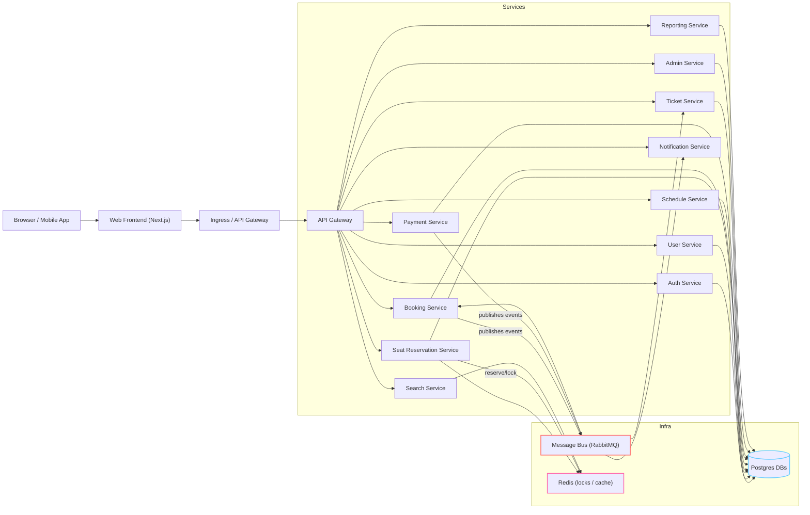
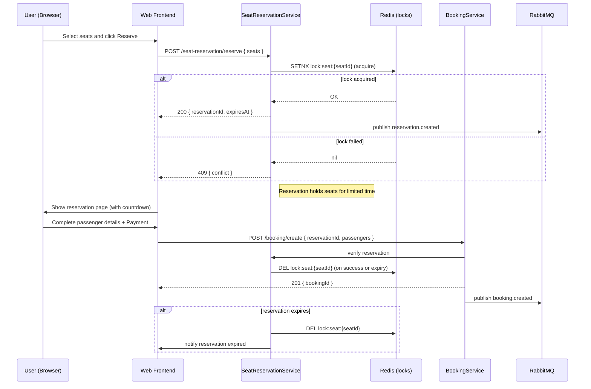
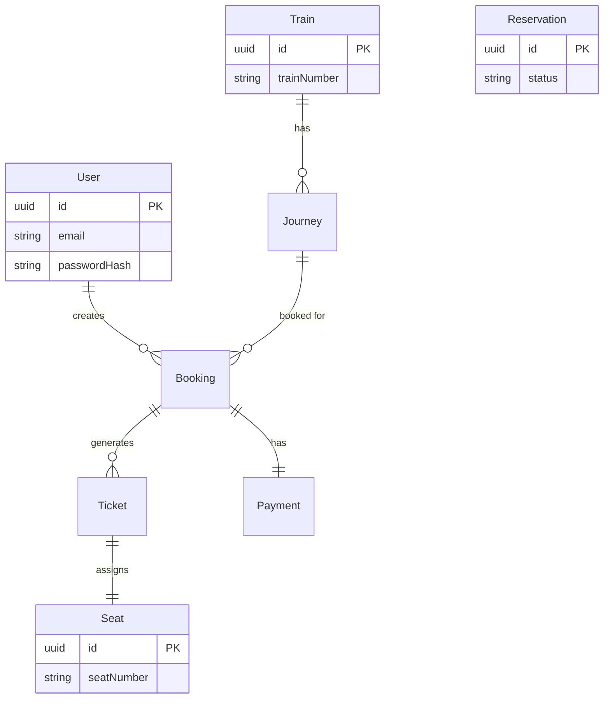
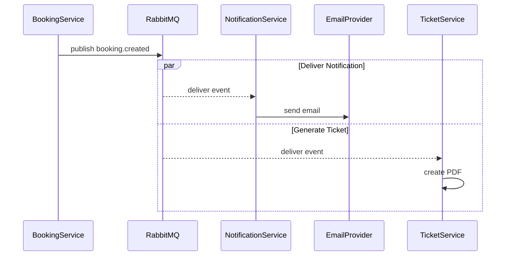
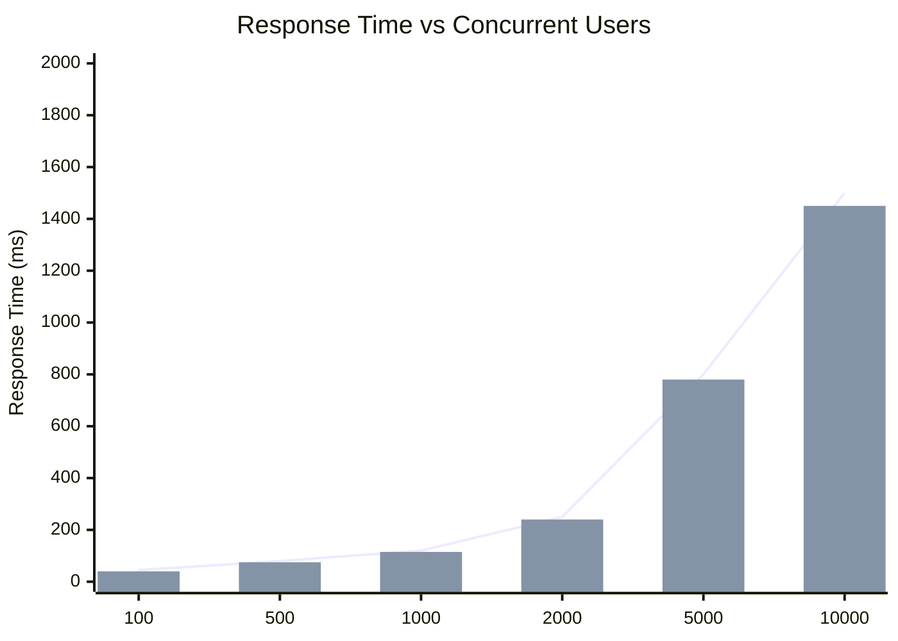
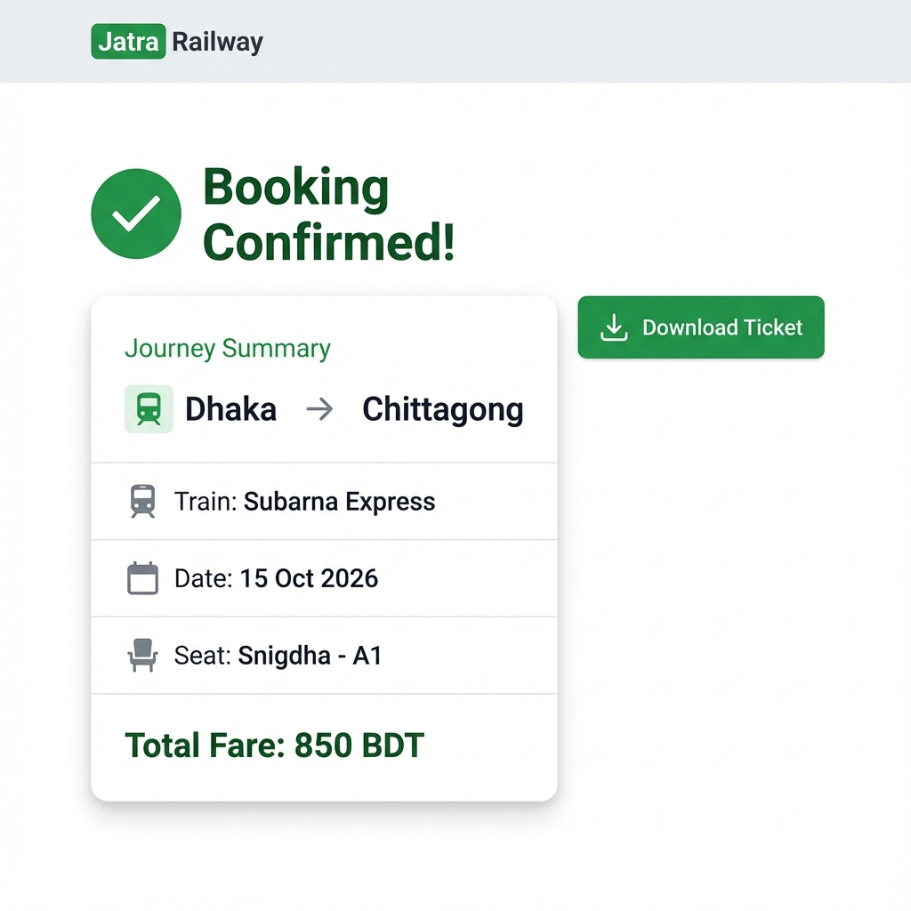
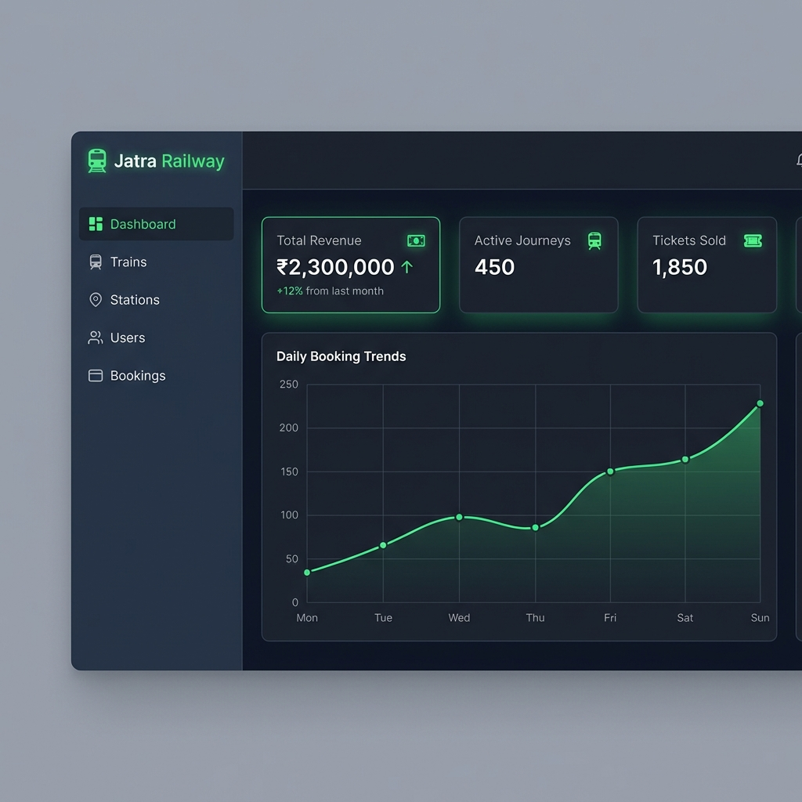
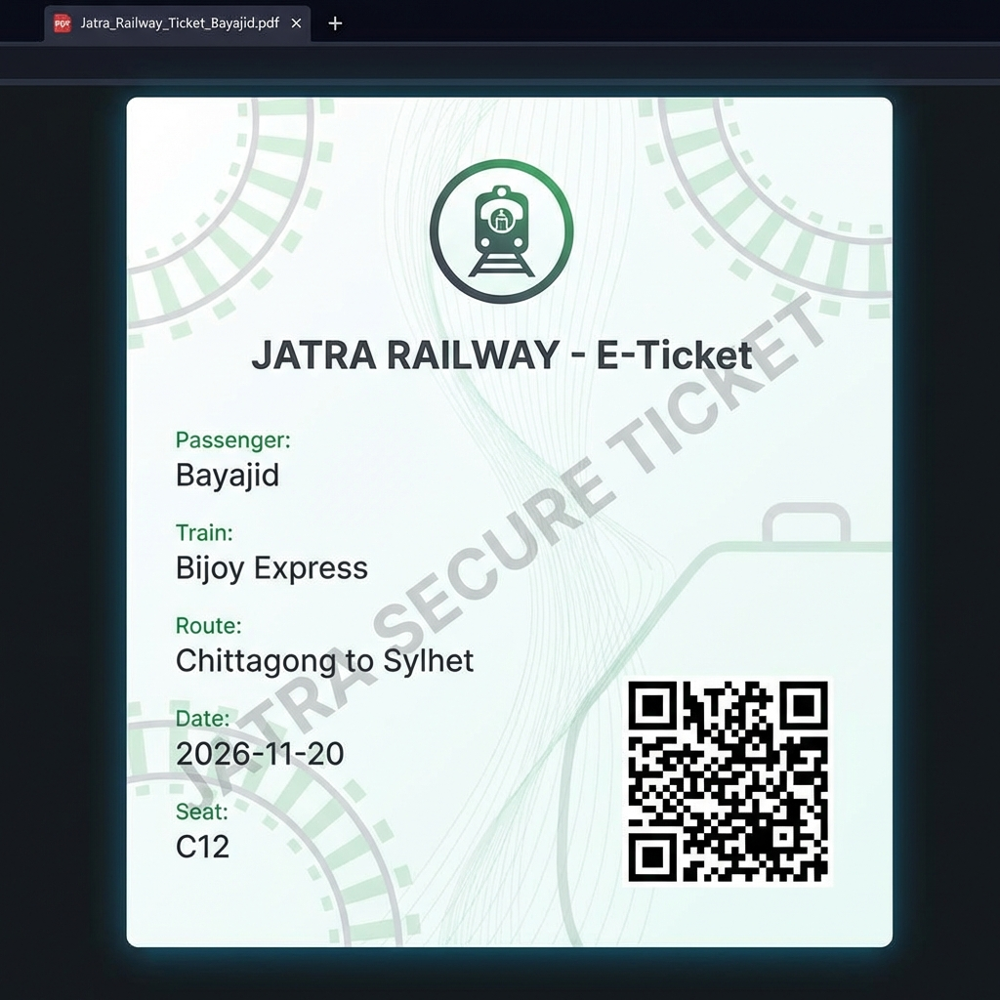

# Final Thesis Report Figures

This document consolidates all 8 figures required for the thesis. These versions are optimized for clarity and accuracy based on the actual codebase.

---

## CHAPTER 3: SYSTEM DESIGN & METHODOLOGY

### Figure 3.1: Microservices Architecture Diagram
*The high-level structure of the Jatra Railway system.*

### Figure 3.2: Redis Seat Locking Sequence Diagram
*Detailing the concurrency control mechanism using Redis locks.*

### Figure 3.3: Database per Service Schema Design
*ERD showing the logically isolated data domains.*

### Figure 3.4: Event-Driven Communication Flow (RabbitMQ)
*The asynchronous flow for notifications and ticketing.*

---

## CHAPTER 4: EVALUATION & RESULTS

### Figure 4.1: Load Test Results: Response Time vs Concurrent Users
*Performance metrics under high traffic.*

### Figure 4.2: Booking Confirmation Page UI

### Figure 4.3: Admin Dashboard UI

### Figure 4.4: Generated PDF Ticket with QR Code

